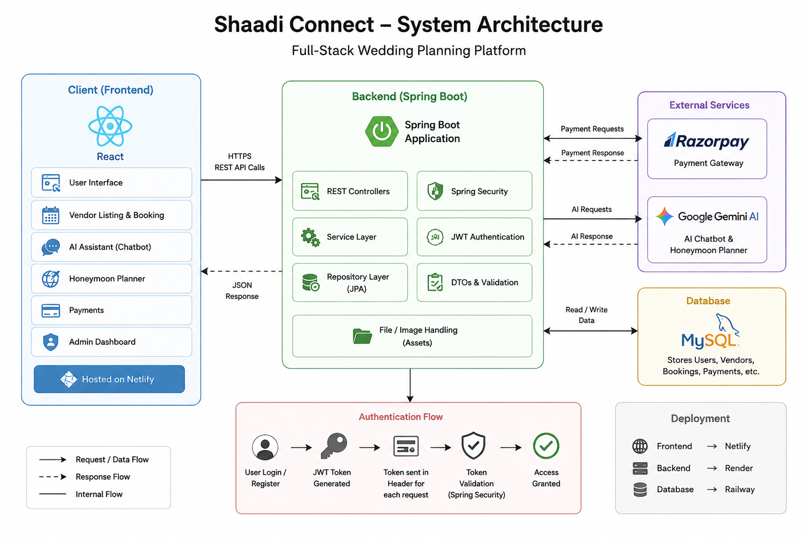

# Shaadi Connect

Shaadi Connect is a full-stack wedding planning platform built using React, Spring Boot, Spring Security, JWT, MySQL, Razorpay, and Google Gemini AI. The platform helps users discover wedding vendors, make secure bookings, process payments, and access AI-powered wedding planning assistance.

---


## Features

- JWT Authentication & Authorization
- Role-Based Access Control
- Vendor Discovery & Booking System
- Razorpay Payment Integration
- AI Wedding Assistant
- AI Honeymoon Planner
- RESTful API Architecture
- Secure Spring Security Configuration
- Responsive UI Design

---

## Tech Stack

### Frontend
- React
- TypeScript
- Vite
- Tailwind CSS

### Backend
- Spring Boot
- Spring Security
- Spring Data JPA
- Hibernate
- JWT Authentication
- Maven

### Database
- MySQL

### APIs & Services
- Razorpay
- Google Gemini AI
- ElevenLabs
- EmailJS

### Deployment
- Netlify (Frontend)
- Render (Backend)
- Railway (Database)

---

## System Architecture



---

## Project Structure

```bash
Shaadi_Connect/
│
├── frontend/
│   ├── src/
│   │   ├── components/
│   │   ├── pages/
│   │   ├── hooks/
│   │   ├── services/
│   │   └── utils/
│   │
│   ├── public/
│   └── package.json
│
├── backend/
│   ├── src/main/java/com/shaadiconnect/
│   │   ├── controller/
│   │   ├── service/
│   │   ├── repository/
│   │   ├── security/
│   │   ├── dto/
│   │   ├── entity/
│   │   └── config/
│   │
│   ├── src/main/resources/
│   ├── assets/
│   └── pom.xml
│
└── README.md
```

---

## Application Workflow

1. User interacts with the React frontend.
2. Frontend sends API requests to the Spring Boot backend.
3. Backend authenticates users using JWT tokens.
4. MySQL stores users, vendors, bookings, and payment data.
5. Razorpay processes secure online payments.
6. Gemini AI provides chatbot and honeymoon planning assistance.
7. Backend returns processed data to the frontend.

---

## API Endpoints

| Method | Endpoint | Description |
|--------|----------|-------------|
| POST | `/api/signup` | User Registration |
| POST | `/api/login` | User Login |
| GET | `/api/vendors` | Fetch Vendors |
| POST | `/api/create-order` | Create Razorpay Order |
| POST | `/api/verify-payment` | Verify Payment |
| POST | `/api/plan-honeymoon` | AI Honeymoon Planner |
| GET | `/api/admin/stats` | Admin Dashboard Statistics |

---

## Run Locally

### Clone Repository

```bash
git clone https://github.com/khushboormeshram/shaadi-connect-platform.git
```

---

### Frontend Setup

```bash
cd frontend
npm install
npm run dev
```

Frontend runs on:

```bash
http://localhost:5173
```

---

### Backend Setup

```bash
cd backend
mvn spring-boot:run
```

Backend runs on:

```bash
http://localhost:8080
```

---

## Environment Variables

### Frontend (.env)

```env
VITE_API_BASE_URL=your_backend_url
VITE_RAZORPAY_KEY_ID=your_razorpay_key
VITE_GEMINI_API_KEY=your_gemini_key
```

### Backend (.env)

```env
SPRING_DATASOURCE_URL=your_mysql_url
SPRING_DATASOURCE_USERNAME=your_username
SPRING_DATASOURCE_PASSWORD=your_password

JWT_SECRET=your_jwt_secret

RAZORPAY_KEY_ID=your_key
RAZORPAY_KEY_SECRET=your_secret

CORS_ALLOWED_ORIGINS=your_frontend_url
```

---

## Security Features

- BCrypt Password Hashing
- JWT-Based Authentication
- Role-Based Authorization
- Secure Payment Verification
- CORS Configuration
- Input Validation

---

## Future Enhancements

- Real-time Notifications
- Vendor Reviews & Ratings
- Wedding Budget Planner
- Booking History Dashboard
- AI Recommendation Engine
- Live Chat System

---

## Author

Khushboo Meshram

